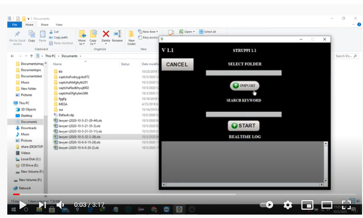

# Google-complex-automation

### User story/ User requirements:

The user wanted an automated solution that can search with a user inserted keyword into google & the software/solution needs to collect contact information (phone, email) from each website found in the search result.

### Steps to automate:

* Search on google with a keyword.
* Wait for all the search results to finish loading.
* Calculate the total number of websites to be found
* Check for the contact us page from each search result.
* Collect email address or phone number from each website
* Continue until all the website have been checked
* Check if there is any next page available or not. If not then it’s the last page
* If there is a next page available on google, go to the next page and repeat all the steps

### Final result :

